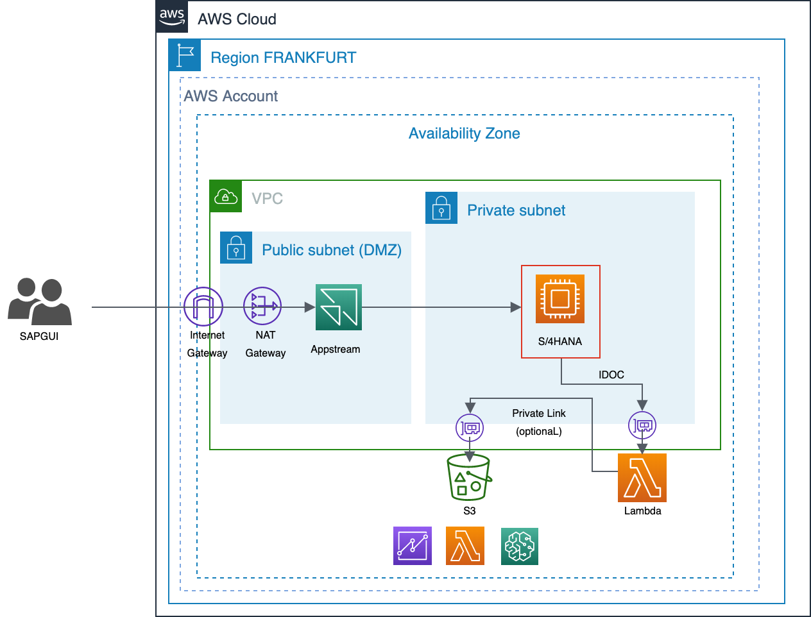

# aws-idoc-playground

This repository is meant as guided walkthrough to create interactions between **AWS S3** and **SAP**, via **AWS Lambda** and the retrieval of **IDOCS**.

This represents **one** simple possibiliity to interact with the SAP backend and process master or transactional data on the AWS platform (e.g. for Big Data / Data Lake, Machine Learning purposes).

The benefits hereby are
- Easy to setup and maintain
- Scales on demand
- Pay "per IDOC"

Inspired by https://aws.amazon.com/de/blogs/awsforsap/sap-idoc-integration-with-amazon-s3-by-using-amazon-api-gateway/

## Prerequisites

- AWS Account (Lambda, S3, API Gateway)
- SAPGUI System Access

## Target Architecture

A typical architecture is depicted below.
The network traffic even can be kept fully internal by switching to VPC Private Link (optional).



## Step 1 - Create a new Lambda function

In the AWS console, navigate to "AWS Lambda".
Create a new function "Author from scratch" -> "NodeJS".
Suggested Name: **myidocfunction**
Make also sure to select an approriate role, see screenshot below:


## Step 2 - Configure & test Lambda function

Modify the function details, by selecting the parent node and perform the following changes:


Now you are ready to test your function via the "TEST" button. Just create some test data and press "TEST".

## Step 3 - Configure & test Lambda function via API Gateway

Via "Add Trigger" -> create a new trigger for API Gateway = **public** API:


For further debugging and insights make sure to add some "console.log(event)" statement to the provided sample code. You might need to select the parent node again to be able to change the code.


```javascript
exports.handler = async (event) => {
    
    //DEBUG
    console.log(event);

    const response = {
        statusCode: 200,
        body: JSON.stringify(event)
    };
    
    return response;
};
```

Now select the API Gateway node and look for the API url!
Click the URL to trigger a GET request via your browser.


Try to find the corresponding cloudwatch logs output of your function:


## Step 4 - IDOC configuration in SAP (DEBMAS)

In SAPGUI go to transaction **sm59** and input the API gateway url and path.


Make also sure to activate SSL:


Test your connection:


## Step 5 - Create a new customer in SAP and send to AWS

You should now be able to send an IDOC to your destination:

TCODE bp - Create a new customer


TCODE bd21 - sent DEBMAS IDOC


Check the output in Cloudwatch Logs and IDOC Monitor **we02**!

## Step 6 - Create S3 bucket

In the AWS console, navigate to **AWS S3** and create a new bucket.
  
**Note:** All settings can be kept default. Also make sure name is unique!!!


## Step 7 - Adjust Lambda to be able to store data in S3

Import AWS SDK

```javascript
var AWS = require("aws-sdk");
...
```

Switch to callback processing

```javascript
var AWS = require("aws-sdk");

exports.handler = (event, context, callback) => {
    
    //DEBUG
    console.log(event);

    callback(null, returnResponse(200,JSON.stringify(event)));
};

function returnResponse(responseCode, responseBody){
    
    const response = {
        statusCode: responseCode,
        body: responseBody
    };
    
    //DEBUG
    console.log(responseBody);
    
    return response;
}
```

Write file to bucket

```javascript
...
//DEBUG
if(!event.body){event.body = "<KUNNR>DEBUG</KUNNR>"};

var bucket = "<your bucket name>";
var id = "test"+Date.now()+".xml";
var params = {Bucket: bucket, Key: id, Body: event.body, ContentType:"text/xml"} 
var options = {} 
var s3 = new AWS.S3() 
s3.upload(params, options, function(err, data) {
    if(err){
        console.log("Error uploading data to S3", err) 
        callback(returnResponse(400,JSON.stringify(err)));
    }else{
        console.log("Data successfully uploaded to S3", data)
        callback(null, returnResponse(200,JSON.stringify(data)));
    }
}) 
...
```

Further Info:
- https://docs.aws.amazon.com/lambda/latest/dg/nodejs-prog-model-handler.html
- https://docs.aws.amazon.com/lambda/latest/dg/with-s3-example.html

## Step 8 - Test

Repeat step 5, create some customer data and check your logs as well as the S3 bucket.


## Step 9 - Bonus

- Use Regexp instead of timestamp - Write unqiue file for each customer only = use KUNNR
```javascript
...
var pattern = /<KUNNR>((.|\n)*?)<\/KUNNR>/;
var mymatch = event.body.match( pattern );
var id = mymatch[1]+".xml";
...
```

- Add X-Ray Monitoring to your function
- Add a Security Token to protect for any misuse
- Aggregate XMLs via another Lambda function

## License

[](./LICENSE.txt)