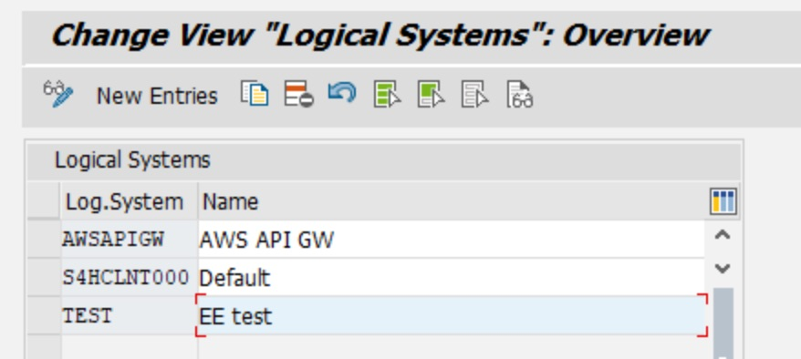
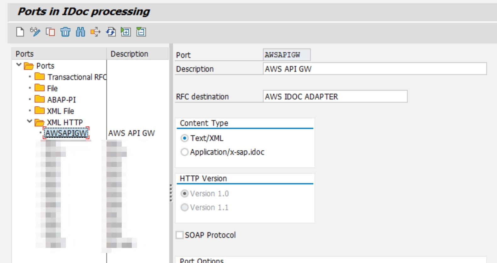
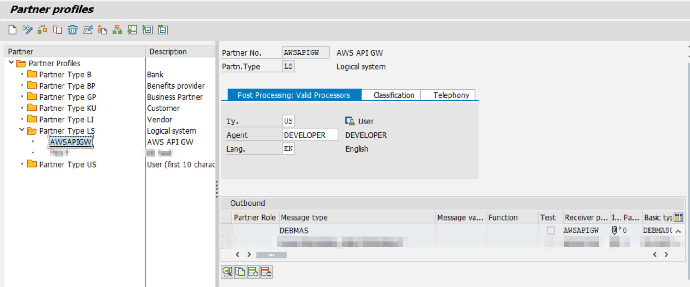
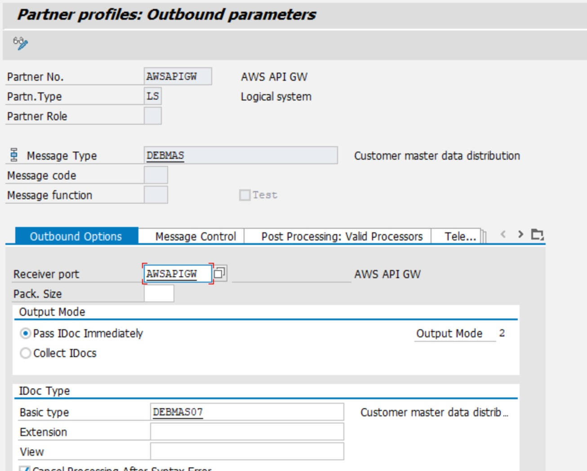
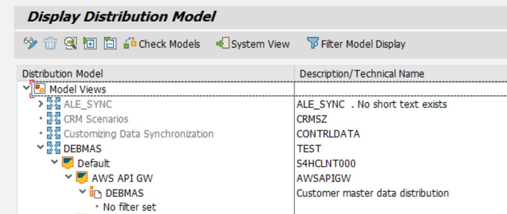

# SAP Backend IDOC Configuration

Example IDOC 'DEBMAS' (= customer / business partner master data)

## sale - Create logical system (LOGSYS)

TCODE sale > Basic Settings > Logical Systems > Define Logical System

Create logical system e.g. AWSAPIGW

## spro - Enable Changepointers for DEBMAS

TCODE spro > SAP NetWeaver > Application Server > Idoc interface/ALE > Modeling and Implementing Business Process > Master data distribution > Replication of modified data > activate change pointers for message types.

https://blogs.sap.com/2010/01/05/sending-idocs-automatically-using-change-pointers/

## strust - Import AWS / Amazon root certificates

TCODE strust

Download all 5 root certificates
https://www.amazontrust.com/repository/

Import into strust

## sm59 - Create HTTP(S) destination

TCODE sm59

HTTP(S) Connection Type 'G'

## we21 - Configure IDoc port and partner profiles

TCODE we21

## we20 - Create outbound parameters for the Partner profile

TCODE we20

## bd64 create distribution model

TCODE bd64

## Useful transactions

- we02 - IDOC Monitor
- we19 - Create Test IDOC